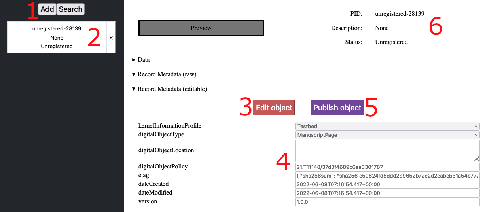
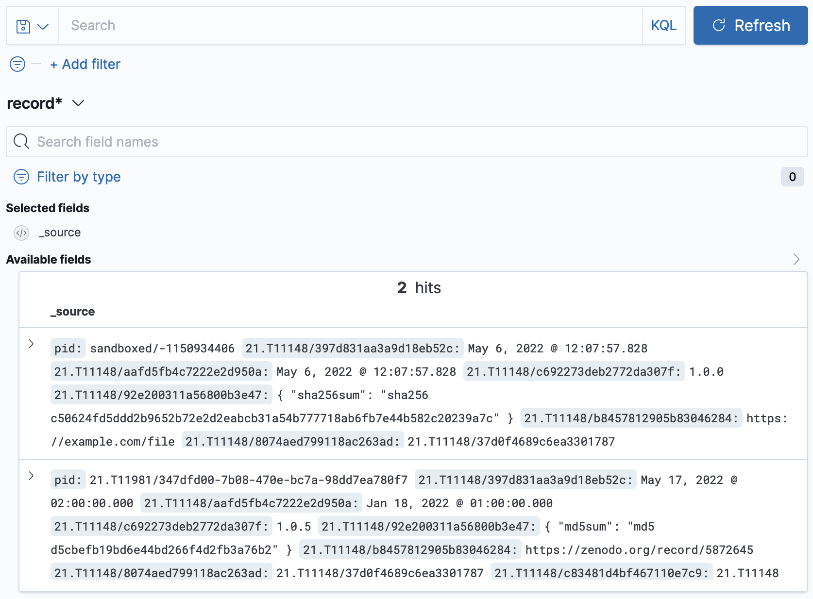

# {{ page.title }}

The FAIR DO Testbed contains user interfaces to demonstrate the services. Not all of them are meant for production.

## Fairris (demonstration interface)

Fairris is a small user interface to register FAIR DOs.
The idea is to give a quick impression of what the Testbed is able to do, as most features require a PID to be created.
The capability of Fairris is limited and meant for demonstrations in combination with the sandboxed PIDs, which the Testbed offers by default.

As soon as the Testbed is started (described in "[Local Setup](docker-compose.html)"), Fairris is available via <http://localhost:8080/>.

A quick guide:

- Click on (1) to add a new local object, and then on (2) to open it.
- See at (6) that the object does not have a PID (unregistered).
- Click on (3) to modify the information. You can then (at (4)) use the "digitalObjectLocation" field to link (or "point") to an object via URL and modify further fields.
- Click on (3) again to save the changes locally.
- Click on (5) to publish an object. This might take some time when doing this the first time, as the cache for validating the information (in the [Typed PID Maker](../typed-pid-maker/index.html)) is empty.
- After that, the local object will close, as it will not have a new identifier.
- Click on (2), where it now has a different identifier (sandboxed). You can now see at (6) that a PID has been registered.
- Repeat the steps to create further FAIR DOs or modify the information in existing ones. Note that this DEMO is missing important fields, for example to link FAIR DOs. It is a minimal example to experience the idea behind FAIR DOs.

## Kibana

Kibana can be used to explore the database, but is being considered a management interface. It is not a simple interface for everyday search requests that should be accessible to all users. Kibana is available via <http://127.0.0.1:5601>.

- Click on discover in the left-side menu.

    {:class="max-h-96"}

- Set `record*` as the index pattern.

    {:class="max-h-52"}

- You can not set a time filter or choose not to.

    {:class="max-h-52"}

- Click on Discover again (see first image)

- View and search through your PIDs.

    {:class="max-h-96"}